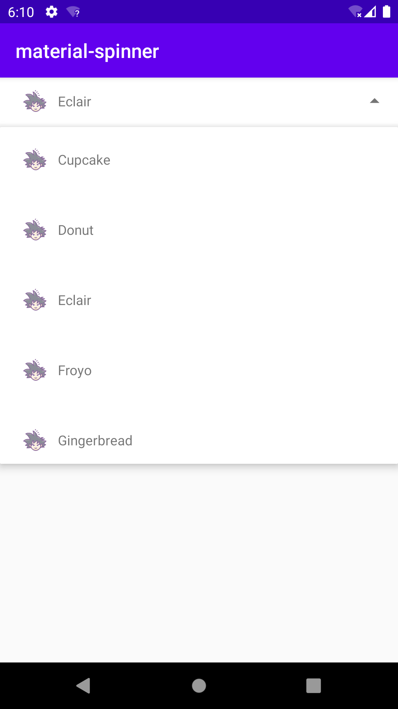

# material-spinner
Just Android's spinner library, support icon 

### Usage

The usage is pretty straightforward. Add the tag into the XML layout:

     <com.pickerx.material.spinner.MaterialSpinner
            android:id="@+id/spinner"
            android:layout_width="match_parent"
            android:layout_height="wrap_content"
            app:layout_constraintStart_toStartOf="parent"
            app:layout_constraintTop_toTopOf="parent"
            app:px_spinner_max_height="350dp"
            app:px_icon_size="@dimen/px__icon_size"
            app:px_placeholder="@mipmap/ic_launcher" />

in code,

    val spinner: MaterialSpinner = findViewById(R.id.spinner)
    val adapter = object : MaterialSpinnerAdapter<String>(this) {
        // [optional]
        override fun downloadIcon(item: String, imageView: ImageView, position: Int) {
            //TODO implement your download image
        }

        // [optional]
        override fun getItemDrawable(position: Int): Drawable? {
            return ResourcesCompat.getDrawable(resources, R.mipmap.ic_wukong, null)
        }
    }

    adapter.onSpinnerSelectedListener = { view: View, i: Int, s: String ->
        Snackbar.make(view, "Clicked${s}", Snackbar.LENGTH_LONG).show()
    }

    spinner.setAdapter(adapter)
    spinner.setItems(ANDROID_VERSIONS)